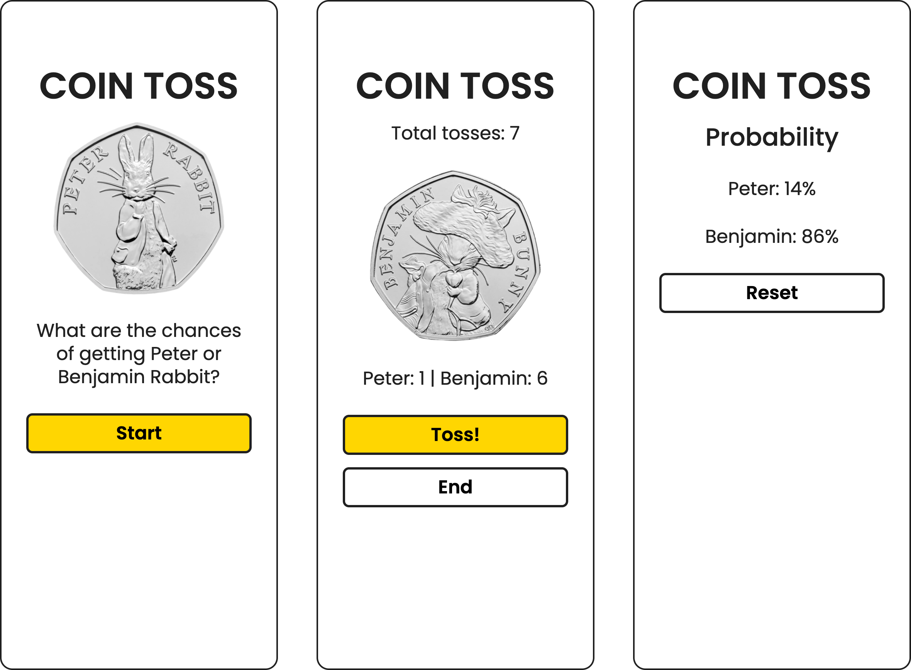

# GAMES COIN TOSS

### Overview
A Javascript based game for coin tossing.

### 1. Project's objective
To learn how to use javascript.

### 2. Design and layout
A three frame coin toss game with a start, middle and end.

### 3. Technical development

#### 3.1 Technologies
- HTML/HTML5
- CSS/SCSS
- Javascript
- JEST
- Babel
- NPM
- IDE PHP Storm

#### 3.2 HTML/HTML5
- Uses HTML5 standards i.e. header, main and footer.

#### 3.3 CSS/SCSS
- The SCSS uses or includes the following:
    - atomic design methodology, and
    - B.E.M methodology for naming classes.

#### 3.4 Javascript
- Developed using functional programming.

#### 3.5 JEST
- Uses JEST to test the probabilities of the coin toss.
